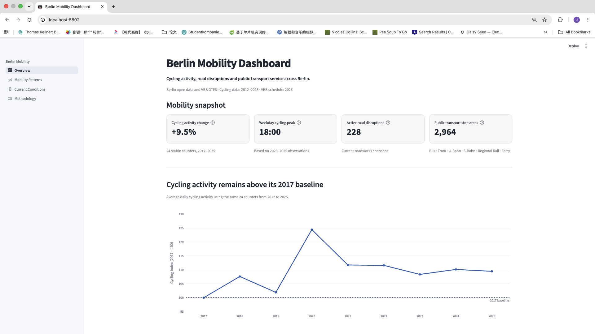
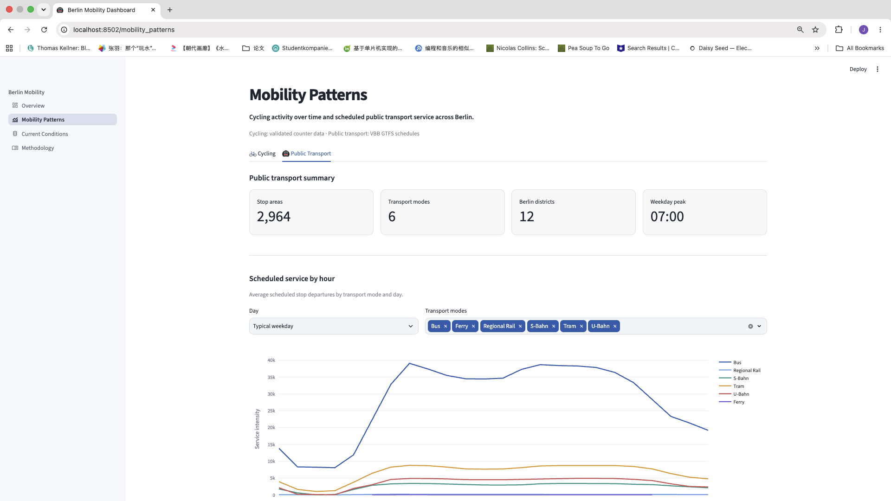
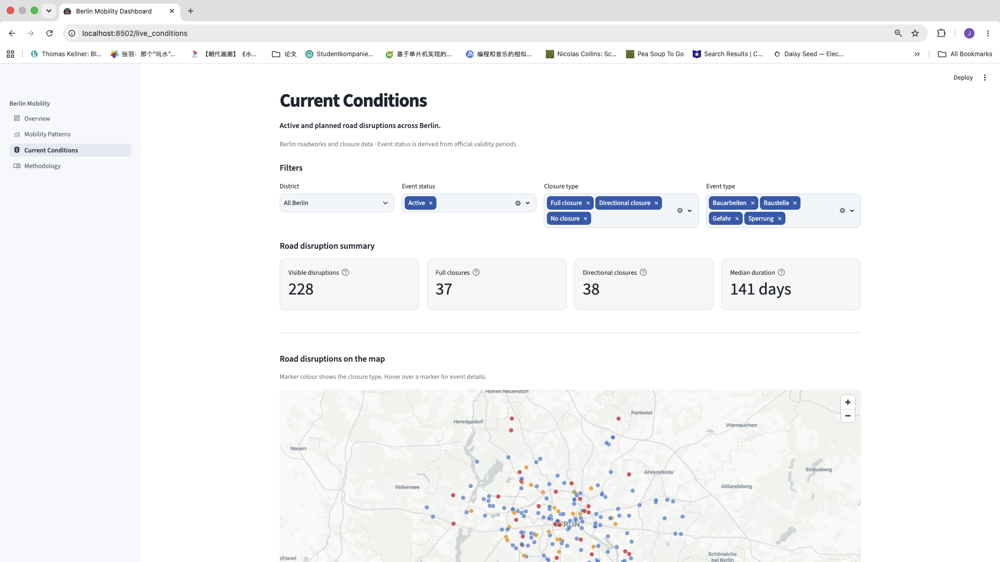
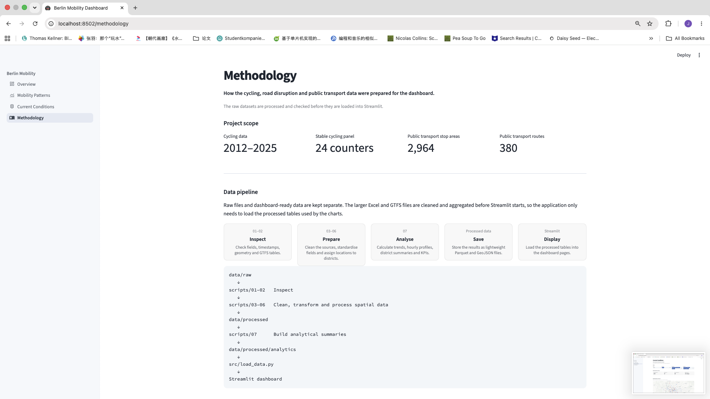

# Berlin Mobility Dashboard

A Streamlit dashboard for exploring cycling activity, road disruptions and scheduled public transport service across Berlin.

The project combines Berlin open data with VBB static GTFS data. It looks at how cycling activity has changed over time, when cycling activity and scheduled public transport service are highest, and where road disruption events are recorded.

**Built with:** Python · Pandas · GeoPandas · GTFS · Plotly · PyDeck · Streamlit · Docker

---

## Live Demo

**Streamlit App:** `<YOUR_STREAMLIT_APP_URL>`

---

## Preview



---

## What the dashboard shows

The dashboard has four pages.

| Page | What it contains |
|---|---|
| **Overview** | Headline indicators for cycling, road disruptions and public transport |
| **Mobility Patterns** | Long-term cycling trends, hourly cycling profiles and scheduled public transport patterns |
| **Current Conditions** | Interactive map and filters for road disruption records |
| **Methodology** | Data sources, processing choices, metric definitions and limitations |

### Overview


### Mobility Patterns



### Current Conditions



### Methodology



---

## Main findings

### Cycling

The long-term cycling comparison uses the same **24 counters from 2017 to 2025**.

For this fixed group of counters:

- average daily cycling activity was about **9.5% higher in 2025 than in 2017**
- the recent weekday cycling profile peaks around **18:00**
- the weekend profile peaks around **14:00**
- the stable-panel index reached its highest level in 2020 and remained above the 2017 baseline afterwards

Using the same counters each year matters because Berlin added cycling counters over time. A comparison based on all available counters would mix changes in cycling activity with changes in the size of the monitoring network.

### Road disruptions

The processed roadworks snapshot contains:

- **228 active disruption events within Berlin**
- **37 active full closures**
- **38 active directional closures**
- a median active-event duration of about **141 days**

Mitte has the highest number of active recorded disruptions in the snapshot.

These figures describe recorded disruption events. They are not direct measures of congestion or travel delay.

### Public transport

After processing the VBB GTFS feed, the Berlin dataset contains:

- **2,964 canonical public transport stop areas**
- **380 routes serving Berlin**
- six transport modes: Bus, Tram, U-Bahn, S-Bahn, Regional Rail and Ferry

Typical weekday scheduled service is highest around **07:00**.

The public transport figures are based on the published GTFS timetable. They describe scheduled service, not passenger numbers, delays or actual vehicle movements.

---

## Data processing

Large raw files are processed before Streamlit starts. The application loads smaller Parquet and GeoJSON outputs instead of repeatedly reading the original Excel and GTFS files.

```text
data/raw
   │
   ▼
01–02  Inspect source files
   │
   ▼
03–06  Clean and prepare each dataset
   │
   ▼
data/processed
   │
   ▼
07     Build analytical tables and KPIs
   │
   ▼
data/processed/analytics
   │
   ▼
src/load_data.py
   │
   ▼
Streamlit dashboard
```

The processing scripts are:

| Script | Purpose |
|---|---|
| `01_inspect_data.py` | Check raw file structure, schemas and sample records |
| `02_inspect_details.py` | Inspect fields that need closer validation |
| `03_prepare_boundaries.py` | Prepare Berlin district boundaries |
| `04_prepare_cycling.py` | Clean cycling counter data and create hourly and daily outputs |
| `05_prepare_roadworks.py` | Prepare road disruption records and map locations |
| `06_prepare_gtfs.py` | Filter and process VBB GTFS data for Berlin |
| `07_exploratory_analysis.py` | Build dashboard summaries, trends and KPIs |

---

## Data sources

### Berlin cycling counters

The cycling source contains hourly counter observations from **2012 to 2025**, together with counter coordinates and installation dates.

The dashboard uses these data for:

- the stable-panel cycling index
- weekday and weekend hourly profiles
- monitored district comparisons

### Berlin road disruptions

The roadworks source contains construction and closure records with fields such as:

- start and end times
- event type
- closure severity
- street and section
- lane information
- geometry

These records are used on the **Current Conditions** page.

### Berlin district boundaries

Official Berlin Bezirk polygons are used to assign cycling counters, road disruption records and public transport locations to Berlin's twelve districts.

### VBB Static GTFS

The VBB feed contains stops, routes, trips, stop times and service calendars for the wider Berlin-Brandenburg network.

The regional feed is spatially filtered to Berlin before the public transport summaries are calculated.

---

## Data issues handled in the pipeline

Some source files required additional checks before they could be used in the dashboard.

### Cycling worksheet dates

The worksheet named `Jahresdatei 2012` contains timestamps from both **2012 and 2013**.

A separate 2013 worksheet also exists, so reading both sheets without checking the dates would count the 2013 observations twice.

Each annual worksheet is therefore restricted to the calendar year in its sheet name.

### Historical counter IDs

Several older cycling worksheets use station IDs that differ from the current metadata.

These IDs are mapped to the current station IDs while the original `raw_station_id` is kept in the processed data.

### Missing cycling observations

Missing counter values are kept as missing values. They are not replaced with zero.

The pipeline also distinguishes observations before a counter was installed from missing observations after installation.

A counter-day is used in the analysis when at least **90% of its expected hourly observations** are available.

### Stable cycling panel

Berlin's cycling counter network expanded over time.

For the long-term comparison, a counter must have at least **300 expected active days** and a usable-day ratio of at least **70%** in every year from 2017 to 2025.

This produces a stable panel of **24 counters**.

### GTFS route types

VBB uses extended GTFS route-type codes in addition to the standard GTFS categories.

The relevant values are grouped into the six modes used in the dashboard:

```text
Bus
Tram
U-Bahn
S-Bahn
Regional Rail
Ferry
```

### GTFS stop areas

Rows in `stops.txt` do not always represent separate physical locations. Many records refer to platforms or boarding positions.

The pipeline uses `parent_station` where available and also derives common VBB stop-area IDs for related records.

After this step, the Berlin service dataset contains **2,964 canonical stop areas**.

### GTFS times after midnight

GTFS times can extend beyond `24:00:00`.

For example:

```text
25:30:00
```

represents 01:30 on the following clock day.

These records are shifted to the correct hour and weekday before hourly service profiles are calculated.

### GTFS service calendars

Scheduled service is calculated using both:

```text
calendar.txt
calendar_dates.txt
```

This includes the regular weekly schedule as well as date-specific service additions and removals.

### Road disruption status

Road disruption status is calculated from the published start and end times and assigned as:

```text
Active
Future
Expired
```

Two source records fall outside Berlin's district boundaries. They remain visible during data-quality checks but are excluded from Berlin-level dashboard figures.

---

## Metric definitions

| Metric | Meaning |
|---|---|
| **Cycling index** | Average daily cycling activity per counter in the stable panel, with 2017 set to 100 |
| **Cycling peak hour** | Hour with the highest average cycling count per monitored counter |
| **Active road disruption** | Recorded road event active at the snapshot time |
| **Full closure** | Active road event classified as a full closure |
| **Public transport stop area** | Canonical stop or station area derived from related GTFS records |
| **Public transport service intensity** | Average scheduled stop departures |
| **Weekend / weekday ratio** | Weekend scheduled service intensity divided by weekday scheduled service intensity |

---

## Project structure

```text
berlin-mobility-dashboard/
│
├── .streamlit/
│   └── config.toml
│
├── assets/
│   ├── overview.png
│   ├── mobility_patterns.png
│   ├── current_conditions.png
│   └── methodology.png
│
├── data/
│   ├── raw/
│   │   ├── boundaries/
│   │   ├── cycling/
│   │   ├── gtfs/
│   │   └── roadworks/
│   │
│   └── processed/
│       └── analytics/
│
├── pages/
│   ├── overview.py
│   ├── mobility_patterns.py
│   ├── live_conditions.py
│   └── methodology.py
│
├── scripts/
│   ├── 01_inspect_data.py
│   ├── 02_inspect_details.py
│   ├── 03_prepare_boundaries.py
│   ├── 04_prepare_cycling.py
│   ├── 05_prepare_roadworks.py
│   ├── 06_prepare_gtfs.py
│   └── 07_exploratory_analysis.py
│
├── src/
│   ├── __init__.py
│   ├── load_data.py
│   └── ...
│
├── .dockerignore
├── Dockerfile
├── app.py
├── requirements.txt
└── README.md
```

---

## Run locally

### 1. Clone the repository

```bash
git clone <YOUR_GITHUB_REPOSITORY_URL>
cd berlin-mobility-dashboard
```

### 2. Create a virtual environment

```bash
python -m venv venv
```

Activate it on macOS or Linux:

```bash
source venv/bin/activate
```

### 3. Install the dependencies

```bash
python -m pip install -r requirements.txt
```

### 4. Start Streamlit

```bash
streamlit run app.py
```

Then open:

```text
http://localhost:8501
```

---

## Run with Docker

Build the image:

```bash
docker build -t berlin-mobility-dashboard .
```

Run the container:

```bash
docker run --rm -p 8502:8501 berlin-mobility-dashboard
```

Then open:

```text
http://localhost:8502
```

Stop the container with `Control + C`.

After changing the application code or processed datasets, rebuild the image before starting the container again.

---

## Rebuild the processed data

Rebuilding the processed datasets requires the source files to be placed in the expected folders under `data/raw/`.

Run the scripts in order from the project root:

```bash
python scripts/01_inspect_data.py
python scripts/02_inspect_details.py
python scripts/03_prepare_boundaries.py
python scripts/04_prepare_cycling.py
python scripts/05_prepare_roadworks.py
python scripts/06_prepare_gtfs.py
python scripts/07_exploratory_analysis.py
```

The Streamlit pages load the resulting processed tables through:

```text
src/load_data.py
```

---

## Limitations

**Cycling counters are not evenly distributed across Berlin.**  
District cycling values describe the monitored counters in that district, not total cycling activity across the whole district.

**Counters only measure activity at fixed locations.**  
Cycling trips that do not pass a monitored counter are not observed.

**The long-term cycling result is based on a fixed panel.**  
The 2017–2025 comparison describes activity across the 24 stable counters rather than all cycling trips in Berlin.

**Road disruption counts are not congestion measures.**  
The number of recorded events does not show how much delay each event causes.

**Road disruption data is snapshot-based.**  
Active and future event counts depend on the time of the source snapshot and will change when the data is refreshed.

**GTFS contains scheduled service.**  
It does not contain passenger demand, occupancy, delays, cancellations or actual vehicle positions.

**District totals are partly affected by geography.**  
District size, network density and the amount of transport infrastructure all affect absolute counts.

---

## Technical stack

| Area | Tools and formats |
|---|---|
| **Data processing** | Python, Pandas, NumPy, OpenPyXL, PyArrow |
| **Spatial processing** | GeoPandas |
| **Dashboard** | Streamlit, Plotly, PyDeck |
| **Data formats** | Excel, Parquet, GeoJSON |
| **Transport data** | GTFS Static |
| **Deployment** | Docker |

---

## Possible next steps

The current public transport analysis uses static GTFS schedules, while the road disruption analysis is based on a single processed snapshot.

Possible extensions include adding GTFS-Realtime data for service disruptions and keeping repeated roadworks snapshots to compare changes over time.

Population or network-length normalisation could also make some district comparisons more useful.

---

## Author

**Xu Jing**

Data analysis · Geospatial analysis · Urban mobility · Streamlit · Docker